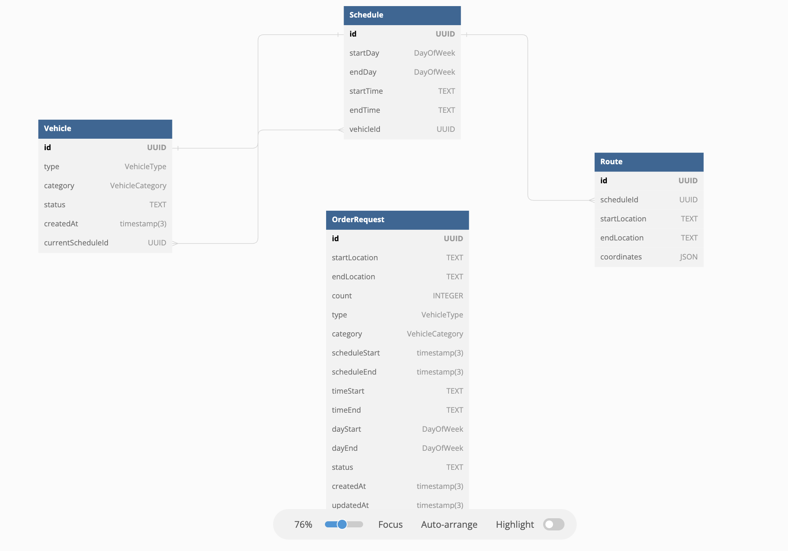

***Innovent Test***

**Assumptions**
- I'm only asked to create one api to save the client vehicle requirement and their schedule. And one api to see the list
- No authention/authorization
- Booking days should have chronology.Week starts from Monday. valid eg. Monday-Friday or Wed-Sunday. invalid e.g Thursday-Tuesday. this can be considered a multiple schedule day range. like Monday-Tuesday And Thurday-Sunday. this is descoped
- This is a demo project with no production related considerations. Thus any request body logging & response throuput logging has not been implemented. Also no Cors and rate limiter is also given
- Since this is a micro project, No documentation tools like swagger has been integrated. however, the sample body will be given below


**API**
considering you are running the project on 3000 port

**POST** `http://localhost:3000/order-requests`
sample body
```
{
    "count": 10,
    "type": "SEDAN",
    "startLocation": "Abu dhabi",
    "endLocation": "Dubai",
    "category": "STANDARD",
    "scheduleStart": "2023-01-01T00:00:00.000Z",
    "scheduleEnd": "2023-01-31T00:00:00.000Z",
    "timeStart": "09:00",
    "timeEnd": "25:30",
    "dayStart": "TUESDAY",
    "dayEnd": "FRIDAY"
}
```

sample response
```
{
    "code": 200,
    "result": {} // array of object
        
}
```

**GET** `http://localhost:3000/order-requests`

sample response
```
{
    "code": 200,
    "result": [] // array of object
        
}
```

**Diagram**



As per the requirement, I've added the core diagram of how we can define relation between different entities
Here Vehicle-Schedule-Route creates a form of relationship which can be used to query several key business questions like
 - how many vehicles are free right now?
 - historical schedules/bookings of each vehicle
 - if a client request can be fullfilled using the available resources

*OrderRequest* table is for holding up the client request.


**Installation & Running the project**

*Pre requisite*
- It is absolutely necessary to have your postgres server running and the database already created. If not, execute the following command in your posgres terminal. `create database <your_database_name>`
- sample .env & .env.test file is added in the repository, which you need to change
- have Node installed in your machine (tested w/ v16.16.0)

- Test environment generally uses a dedicated dispensable database. it is given on .env.test file


**Steps**

```
npm install
npx prisma generate
npx prisma migrate dev (prisma migrates the tables & releations from the above command)
npm run dev
```
steps 2 & 3 needs to be executed once only.

**steps to run test**
Make sure you update the .env.test file with your `DATABASE_URL` and you already have the database created

```
npm run test
```

**Notes**
1. I have used Prisma over Sequelize/TypeORM. Because I found this more intuitive and less verbose to work on. Primsa generates a client package from the prisma.schema file with first class typescript support
2. Zod is something I'm using it first time, there maybe some better practices which I'm not aware of
3. It was not clearly defined what to be test. I assumed it to be API test(since there's barely any business logic implemented, unit test might not much do in this scope of the project). One test cases have been written using supertest & Jest